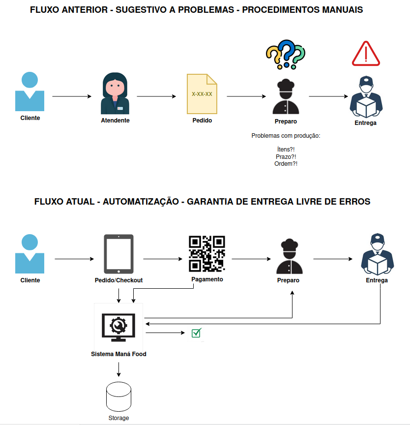

# Maná Food

# Diagrama - Resquisitos do Negócio


# Diagrama - Infraestrutura para fase II


## Estrutura de Pastas

```
mana-food-clean-architecture/
├── Core/
│   ├── ManaFood.Application/      # Camada de aplicação (casos de uso, serviços, validações, configurações)
│   │   ├── Configurations/
│   │   ├── Shared/               
│   │   └── UseCases/
│   └── ManaFood.Domain/           # Camada de domínio (entidades, interfaces, regras de negócio)
│   │   ├── Entidades/        
│   │   └── Interfaces/
├── Infrastructure/
│   └── ManaFood.Infrastructure/   # Infraestrutura (acesso a dados, repositórios, contexto do banco)
│       ├── Configurations/
│       └── Database/
│           ├── Configuration/
│           ├── Context/
│           └── Repositories/
├── Presentation/
│   └── ManaFood.WebAPI/           # Camada de apresentação (controllers, configuração da API)
│       ├── Controllers/
│       ├── Properties/
│       ├── appsettings.json
|       ├── appsettings.Development.json
│       └── Dockerfile
├── README.md
├── .gitignore
├── docker-compose.yml
├── LICENSE
└── ManaFood.sln
```

## Descrição dos Principais Diretórios

- **Core/ManaFood.Application/**: Implementa os casos de uso da aplicação, validações, comportamentos compartilhados e configurações específicas da camada de aplicação.
- **Core/ManaFood.Domain/**: Contém as entidades de domínio, interfaces e regras de negócio puras, sem dependências externas.
- **Infrastructure/ManaFood.Infrastructure/**: Responsável pela implementação da infraestrutura, como acesso a banco de dados, repositórios, contexto do Entity Framework e configurações relacionadas à persistência.
- **Presentation/ManaFood.WebAPI/**: Camada de apresentação, onde ficam os controllers da API, configurações do ASP.NET Core, arquivos de configuração (appsettings) e propriedades do projeto.

## Explicação do Docker

### O que é o Dockerfile?

O `Dockerfile` define como a imagem da aplicação será construída. No caso deste projeto, ele:

- Usa uma imagem base do ASP.NET para rodar a aplicação.
- Usa uma imagem do SDK do .NET para compilar e publicar o projeto.
- Copia os arquivos publicados para a imagem final.
- Define o comando de inicialização da API.

### O que é o docker-compose.yml?

O `docker-compose.yml` orquestra múltiplos containers. Aqui, ele:

- Sobe um container MySQL já configurado para o projeto.
- Sobe a aplicação ASP.NET, conectando-a ao banco de dados.
- Define variáveis de ambiente e mapeia as portas necessárias.

---

## Como executar o projeto

### 1. Clonando o repositório

```sh
git clone https://github.com/mana-food/mana-food-clean-architecture.git
cd mana-food-clean-architecture
```

### 2. Executando localmente

Certifique-se de ter o [.NET 9](https://dotnet.microsoft.com/en-us/download/dotnet/9.0) instalado e um banco de dados MySQL rodando.

1. Navegue até o arquivo de configuração:
   ```
   Presentation/ManaFood.WebAPI/appsettings.json
   ```

2. Localize a seção `ConnectionStrings`:
   ```json
   {
     "ConnectionStrings": {
       "DefaultConnection": "server=localhost;database=manafood;user=seu_usuario;password=sua_senha;charset=utf8mb4;"
     }
   }
   ```

3. Substitua os valores:
   - `seu_usuario`: Seu usuário do MySQL
   - `sua_senha`: Sua senha do MySQL
   - `localhost`: Endereço do servidor (mantenha se for local)
   - `manafood`: Nome do banco (será criado automaticamente)

4. Exemplo de configuração:
   ```json
   {
     "ConnectionStrings": {
       "DefaultConnection": "server=localhost;database=manafood;user=root;password=123456;charset=utf8mb4;"
     }
   }
   ```

   # Utilização do Ngrok para Webhook
   A variável MERCADOPAGO_NOTIFICATION_URL deve conter um endpoint público, para que o Mercado Pago envie notificações. Como a aplicação roda localmente, usamos o Ngrok para gerar esse link acessível pela internet. Contudo, esse link muda sempre que o Ngrok é reiniciado. Por esse motivo, disponibilizamos os passos abaixo, possibilitando a sequência de testes.

   # Como usar o Ngrok para o webhook

   1 - Instale o Ngrok.
   2 - No terminal, execute o comando: 
   ```sh
   ngrok http https://localhost:5111
   ```
   3 - Copie o ID gerado (ex: https://SEU_NGROK_ID.ngrok-free.app), atualizando a string da variável de ambiente "MERCADOPAGO_NOTIFICATION_URL".

5. Execute a aplicação:

    ```sh
    dotnet run --project Presentation/ManaFood.WebAPI/ManaFood.WebAPI.csproj
    ```

### 3. Executando os containers
Segue um passo a passo simples para rodar os containers do projeto:

---

### Como rodar os containers com Docker

1. **Pré-requisitos**  
   Certifique-se de ter o [Docker](https://www.docker.com/get-started) e o [Docker Compose](https://docs.docker.com/compose/) instalados.


2. **Clone o repositório (caso ainda não tenha feito):**
   ```sh
   git clone https://github.com/mana-food/mana-food-clean-architecture.git
   cd mana-food-clean-architecture
   ```

3. **Verifique se os arquivos `docker-compose.yml` e `Presentation/ManaFood.WebAPI/Dockerfile` existem.**  
   Eles já estão prontos no projeto.

4. Navegue até o arquivo de configuração:
   ```
   Presentation/ManaFood.WebAPI/appsettings.json
   ```

5. Localize a seção `ConnectionStrings`:
   ```json
   {
     "ConnectionStrings": {
       "DefaultConnection": "server=localhost;port=porta;database=nome_do_banco;user=seu_usuario;password=sua_senha;"
     }
   }
   ```

6. Substitua os valores:
   - `seu_usuario`: Seu usuário do MySQL configurado no docker-compose.yml
   - `sua_senha`: Sua senha do MySQL no docker-compose.yml
   - `localhost`: Endereço do servidor (nome do serviço docker)
   - `nome_do_banco`: Nome do banco configurado no docker-compose.yml  

7. Configure a seção `ConnectionStrings` dessa forma:
   ```json
   {
     "ConnectionStrings": {
       "DefaultConnection": "server=db-mana-food;port=3307;database=db_manafood;user=root;password=senha123;"
     }
   }
   ```

8. **Suba os containers:**  
   No terminal, na raiz do projeto, execute:
   ```sh
   docker-compose up --build
   ```

9. **Aguarde a inicialização.**  
   O Docker irá baixar as imagens necessárias, criar os containers e iniciar a aplicação.


10. **Acesse a aplicação:**  
   - API: [http://localhost:8080/index.html](http://localhost:8080/index.html)  
   - MySQL: `localhost:3306` -> Verifique o usuário e senha no `docker-compose.yml`


11. **Para parar os containers:**  
   Pressione `Ctrl+C` no terminal ou execute:
   ```sh
   docker-compose down
   ```

---

### 4. Gerar migrations com EF Core

1. Instale a ferramenta do EF:

    ```sh
    dotnet tool install --global dotnet-ef
    ```

2. Gere a migration:

    ```sh
    dotnet ef migrations add NOME_DA_SUA_MIGRATION --project Infrastructure/ManaFood.Infrastructure --startup-project Presentation/ManaFood.WebAPI
    ```
---
### 5. Explicação da Autenticação e Autorização

#### Visão Geral

A aplicação utiliza autenticação baseada em JWT (JSON Web Token) para garantir que apenas usuários autenticados possam acessar endpoints protegidos. A autorização é feita por meio de roles, permitindo restringir o acesso conforme o tipo de usuário.

#### Autenticação 🔐

- O usuário realiza login e recebe um token JWT.
- O token deve ser enviado no header `Authorization` em todas as requisições protegidas:
  ```
  Authorization: Bearer {seu_token_jwt}
  ```
- O middleware `JwtAuthenticationMiddleware` intercepta as requisições, valida o token e define o usuário autenticado no contexto da aplicação.

#### Autorização 👤

- Para proteger endpoints, utilize o atributo `[CustomAuthorize]` nos controllers ou actions.
- É possível restringir o acesso por tipo de usuário (roles) usando o enum `UserType`:
  ```csharp
  [CustomAuthorize(UserType.Admin, UserType.Manager)]
  public IActionResult EndpointProtegido() { ... }
  ```
- O atributo verifica se o token é válido e se o usuário possui uma das roles informadas. Caso contrário, retorna `Unauthorized` ou `Forbid`.

#### Fluxo de Validação

1. **Middleware**: Valida o token JWT em todas as requisições.
2. **Atributo CustomAuthorize**: Opcionalmente, valida se o usuário possui a role necessária antes de executar a ação.
---
### 6. Documentação Complementar

#### Documentação Notion:
```sh
https://chartreuse-fountain-62d.notion.site/203ce57501598031b488df683ec4c8dd?v=203ce57501598002923d000c738029fd&source=copy_link
```

#### Documentação MIRO:
```sh
https://miro.com/app/board/uXjVIHWEfCI=/
```

#### Vídeo Explicativo:
```sh
https://drive.google.com/file/d/1oNyHA0dApnlPXia9Ov5fdcj2vpKXEQVb/view?usp=sharing
```