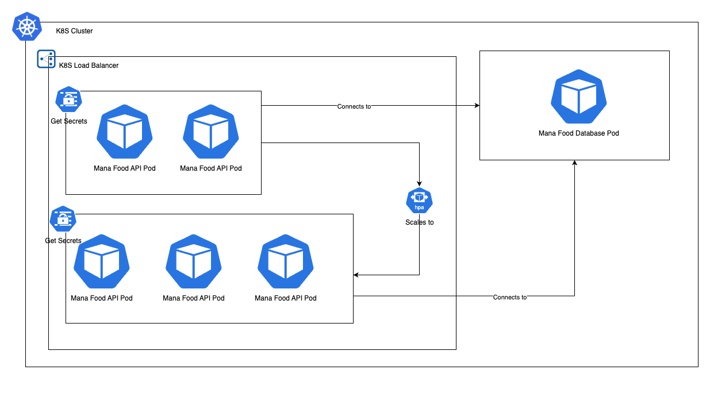
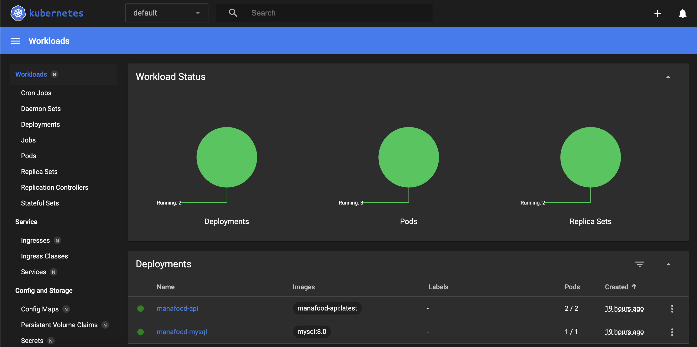

# Maná Food

## Diagrama - Resquisitos do Negócio


## Diagrama - Infraestrutura para fase II



## Estrutura de Pastas

```
mana-food-clean-architecture/
├── Core/
│   ├── ManaFood.Application/      # Camada de aplicação (casos de uso, serviços, validações, configurações)
│   │   ├── Configurations/
│   │   ├── Shared/               
│   │   └── UseCases/
│   └── ManaFood.Domain/           # Camada de domínio (entidades, interfaces, regras de negócio)
│   │   ├── Entidades/        
│   │   └── Interfaces/
├── Infrastructure/
│   └── ManaFood.Infrastructure/   # Infraestrutura (acesso a dados, repositórios, contexto do banco)
│       ├── Configurations/
│       └── Database/
│           ├── Configuration/
│           ├── Context/
│           └── Repositories/
├── k8s/                           # Infraestrutura Kubernetes utilizando IAC
├── Presentation/
│   └── ManaFood.WebAPI/           # Camada de apresentação (controllers, configuração da API)
│       ├── Controllers/
|       ├── Filters/
│       ├── Middlewares/
│       ├── Properties/
│       ├── appsettings.json
|       ├── appsettings.Development.json
│       └── Dockerfile
│       └── Webhooks/
│           └── MercadoPago/
└── Test/
│   └── ManaFood.UnitTest/
├── README.md
├── .gitignore
├── docker-compose.yml
├── LICENSE
└── ManaFood.sln
```

## Descrição dos Principais Diretórios

- **Core/ManaFood.Application/**: Implementa os casos de uso da aplicação, validações, comportamentos compartilhados e configurações específicas da camada de aplicação.
- **Core/ManaFood.Domain/**: Contém as entidades de domínio, interfaces e regras de negócio puras, sem dependências externas.
- **Infrastructure/ManaFood.Infrastructure/**: Responsável pela implementação da infraestrutura, como acesso a banco de dados, repositórios, contexto do Entity Framework e configurações relacionadas à persistência.
- **Presentation/ManaFood.WebAPI/**: Camada de apresentação, onde ficam os controllers da API e Webhook, configurações do ASP.NET Core, arquivos de configuração (appsettings) e propriedades do projeto.

## Explicação do Docker

### O que é o Dockerfile?

O `Dockerfile` define como a imagem da aplicação será construída. No caso deste projeto, ele:

- Usa uma imagem base do ASP.NET para rodar a aplicação.
- Usa uma imagem do SDK do .NET para compilar e publicar o projeto.
- Copia os arquivos publicados para a imagem final.
- Define o comando de inicialização da API.

### O que é o docker-compose.yml?

O `docker-compose.yml` orquestra múltiplos containers. Aqui, ele:

- Sobe um container MySQL já configurado para o projeto.
- Sobe a aplicação ASP.NET, conectando-a ao banco de dados.
- Define variáveis de ambiente e mapeia as portas necessárias.

---

## Meio de Pagamento: QRCode Mercado Pago | Integração para Webhook - Pagamento Aprovado

   A criação do Webhook com integração no Mercado Pago solicita o cadastro de uma URL pública para resposta. Portanto, selecionamos o serviço "Ngrok" na performance desta ação.
   
   Acesse a ferramenta Ngrok [aqui](https://ngrok.com/).
   
   Ngrok é uma ferramenta que cria um túnel seguro da internet para sua máquina local. Em outras palavras, ele gera um link público (tipo https://7cdbccf5ea42.ngrok-free.app) que redireciona para o seu servidor local (http://localhost:port), mesmo que você esteja atrás de um roteador, firewall ou em uma rede privada. 
   
   Como o link Ngrok muda sempre que o acesso é reiniciado, disponibilizamos os passos abaixo para utilização da ferramenta - Como usar o Ngrok para o webhook:

   1 - Instale o Ngrok.
   
   2 - No terminal, execute o comando abaixo para gerar a URL pública no Ngrok. Esta URL será inserida no arquivo de configurações, na sequência de execução subsequente. 
   ```sh
   ngrok http https://localhost:5111
   ```

## Como executar o projeto

### 1. Clonando o repositório

```sh
git clone https://github.com/mana-food/mana-food-clean-architecture.git
cd mana-food-clean-architecture
```

### 2. Executando localmente

Certifique-se de ter o [.NET 9](https://dotnet.microsoft.com/en-us/download/dotnet/9.0) instalado e de que um banco de dados MySQL esteja em execução.

1. Navegue até o arquivo de configuração:
   ```
   Presentation/ManaFood.WebAPI/Properties/launchSettings.json
   ```

2. Localize a chave `CONNECTION_STRING`.

   2.1. Substitua os valores:
      - `server`: Endereço do servidor (mantenha se for local)
      - `port`: 3306
      - `database`: Nome do banco (será criado automaticamente)
      - `user`: Seu usuário do MySQL
      - `password`: Sua senha do MySQL

3. Localize as variáveis de ambiente:

         MERCADOPAGO_ACCESS_TOKEN
      
         MERCADOPAGO_NOTIFICATION_URL
      
         MERCADOPAGO_USER_ID
      
         MERCADOPAGO_STORE_ID
      
         MERCADOPAGO_EXTERNAL_STORE_ID
      
         MERCADOPAGO_EXTERNAL_POS_ID
     
      - Utilize o ID Ngrok gerado anteriormente (ex: https://SEU_NGROK_ID.ngrok-free.app), atualizando o texto da chave "MERCADOPAGO_NOTIFICATION_URL".
  
5. Crie uma conta de teste com o perfil "cliente" e forma de pagamento "QRCode" para pagamento do QRCode que será gerado na aplicação, conforme passos disponibilizados [aqui](https://www.mercadopago.com.br/developers/pt/docs/qr-code/additional-content/your-integrations/test/accounts).
   A conta de teste deverá ser acessada via aplicativo para leitura da imagem QR e quando efetivado o pagamento, reserve o número da operação. Este número deverá ser alimentado na chamada "payment-confirmation" no campo "ID" dos passos abaixo "Ordem de execução das APIs" parar gerar a notificação Webhook, confirmando o sucesso da operação.

7. Execute a aplicação:

    ```sh
    dotnet run --project Presentation/ManaFood.WebAPI/ManaFood.WebAPI.csproj
    ```

### 3. Executando os containers
Segue um passo a passo simples para rodar os containers do projeto:

---

### Como rodar os containers com Docker

1. **Pré-requisitos**  
   Certifique-se de ter o [Docker](https://www.docker.com/get-started) e o [Docker Compose](https://docs.docker.com/compose/) instalados.


2. **Clone o repositório (caso ainda não tenha feito):**
   ```sh
   git clone https://github.com/mana-food/mana-food-clean-architecture.git
   cd mana-food-clean-architecture
   ```

3. **Verifique se os arquivos `docker-compose.yml` e `Presentation/ManaFood.WebAPI/Dockerfile` existem.**  
   Eles já estão prontos no projeto.

4. Certifique-se de que o arquivo de configuração esteja alinhado com as instruções anteriores (launchSettings.json).
  
5. **Suba os containers:**  
   No terminal, na raiz do projeto, execute:
   ```sh
   docker-compose up --build
   ```

6. **Aguarde a inicialização.**  
   O Docker irá baixar as imagens necessárias, criar os containers e iniciar a aplicação.


7. **Acesse a aplicação:**  
   - API: [http://localhost:8080/index.html](http://localhost:8080/index.html)  
   - MySQL: `localhost:3306` -> Verifique o usuário e senha no `docker-compose.yml`


8. **Para parar os containers:**  
   Pressione `Ctrl+C` no terminal ou execute:
   ```sh
   docker-compose down
   ```

### Como rodar os containers com Kubernetes

1. **Pré-requisitos**
   Certifique-se de ter o [Kubernetes](https://kubernetes.io/) e o [Minikube](https://minikube.sigs.k8s.io/docs/start/) instalados em sua máquina.

2. **Registre a localmente a imagem utilizando o Minikube**
   No terminal, realize os seguintes comandos:
   ```
   cd Presentation/ManaFood.WebAPI
   eval $(minikube docker-env)
   docker build -t manafood-api:latest .
   ```
   Com isso, o minikube acessará a imagem se a necessidade de um registry externo

3. **Implemente o manifesto Kubernetes**
   
   1. No terminal, na raiz do projeto, realize os comandos na sequencia abaixo:
   ```
   cd k8s
   kubectl applly -f api-configmap.yaml
   kubectl applly -f api-secret.yaml
   kubectl applly -f db-service.yaml
   kubectl applly -f db-deployment.yaml
   kubectl applly -f api-service.yaml
   kubectl applly -f api-deployment.yaml
   kubectl applly -f api-hpa.yaml
   ```
   Serão criados sequencialmente:

   - ConfigMaps: Variáveis de ambiente do sistema
   - Secrets: Variáveis de ambiente que possuem dados sensíveis
   - Db Service: Cluster para o banco de dados
   - Db Deployment: Pod com suas devidas réplicas e especificações
   - API Service: LoadBalancer para a API
   - API Deployment: Pod com suas devidas réplicas e especificações
   - API HPA: Horizontal auto-scaling para os pods implementados em API Deployment

   Feito isso, valide os status dos seus pods e config pela interface do Minekube

   2. Também no terminal, rode o seguinte comandos:    
   ```
   minikube start
   ```
   E depois
   ```
   minikube dashboard
   ```
   A seguinte interface aparecerá para realizar o gerenciamento de Kubernetes:

   
---

## API Gateway - Configuração das Rotas

Para utilizar o API Gateway, você precisará configurar os endereços da sua API e Lambda através de variáveis de ambiente. Estas variáveis devem conter as URLs públicas ou locais dos seus serviços:

1. Configure a variável `API_DESTINATION` com a URL da sua API principal:
   ```sh
   export API_DESTINATION="sua-url-da-api"
   ```

2. Configure a variável `LAMBDA_DESTINATION` com a URL do seu serviço Lambda:
   ```sh
   export LAMBDA_DESTINATION="sua-url-lambda"
   ```

Importante: Use as URLs específicas do seu ambiente de execução. Estas URLs devem ser as mesmas que você usa para acessar seus serviços.

---

### 4. Gerar migrations com EF Core

1. Instale a ferramenta do EF:

    ```sh
    dotnet tool install --global dotnet-ef
    ```

2. Gere a migration:

    ```sh
    dotnet ef migrations add NOME_DA_SUA_MIGRATION --project Infrastructure/ManaFood.Infrastructure --startup-project Presentation/ManaFood.WebAPI
    ```
---
### 5. Explicação da Autenticação e Autorização

#### Visão Geral

A aplicação utiliza autenticação baseada em JWT (JSON Web Token) para garantir que apenas usuários autenticados possam acessar endpoints protegidos. A autorização é feita por meio de roles, permitindo restringir o acesso conforme o tipo de usuário.

#### Autenticação 🔐

- O usuário realiza login e recebe um token JWT.
- O token deve ser enviado no header `Authorization` em todas as requisições protegidas:
  ```
  Authorization: Bearer {seu_token_jwt}
  ```
- O middleware `JwtAuthenticationMiddleware` intercepta as requisições, valida o token e define o usuário autenticado no contexto da aplicação.

#### Autorização 👤

- Para proteger endpoints, utilize o atributo `[CustomAuthorize]` nos controllers ou actions.
- É possível restringir o acesso por tipo de usuário (roles) usando o enum `UserType`:
  ```csharp
  [CustomAuthorize(UserType.Admin, UserType.Manager)]
  public IActionResult EndpointProtegido() { ... }
  ```
- O atributo verifica se o token é válido e se o usuário possui uma das roles informadas. Caso contrário, retorna `Unauthorized` ou `Forbid`.

#### Fluxo de Validação

1. **Middleware**: Valida o token JWT em todas as requisições.
2. **Atributo CustomAuthorize**: Opcionalmente, valida se o usuário possui a role necessária antes de executar a ação.
---

### 6. Ordem de execução das APIs

**Pré requisitos**:
   - Conta do Mercado Pago
   - Conta no NGrok

1. Autenticação
   - Crie um usuário na API de usuário (User - POST)
   - Execute a API de autenticação para gerar um token JWT no endpoint de login (Auth - POST)
   - Coloque o token JWT no Authorize no swagger
2. Criar um Produto
   - Execute a API de categoria para criar uma categoria (Category - POST)
   - Execute a API de item para criar um ou mais itens (Item - POST)
   - Execute a API de produto para criar o produto (Product - POST)
3. Criar um Pedido
   - Execute a API de pedido para criar um pedido (Order - POST)
4. Realizar o Pagamento
   - Execute a API de pagamentos para gerar o QR Code no Mercado Pago (PaymentClient - POST)
   - Execute a API de pagamentos para visualizar o QR Code gerado (PaymentClient - GET)
   - Escanei o QRCode no aplicativo do Mercado Pago para gerar o pagamento na conta de teste
   - Execute a API de confirmação de pagamento para atualizar o pedido (MercadoPagoWebhookReceiver - POST)

---
### 7. Documentação Complementar

#### Documentação Notion:
```sh
https://chartreuse-fountain-62d.notion.site/203ce57501598031b488df683ec4c8dd?v=203ce57501598002923d000c738029fd&source=copy_link
```

#### Documentação MIRO:
```sh
https://miro.com/app/board/uXjVIHWEfCI=/
```

#### Vídeo Explicativo (YouTube) | FIAP Pós Tech Challenge Fase 2 - Grupo ManaFood (GERENCIAMENTO DE KUBERNETES):
```sh
https://www.youtube.com/watch?v=60IeDq_nK6I
```
